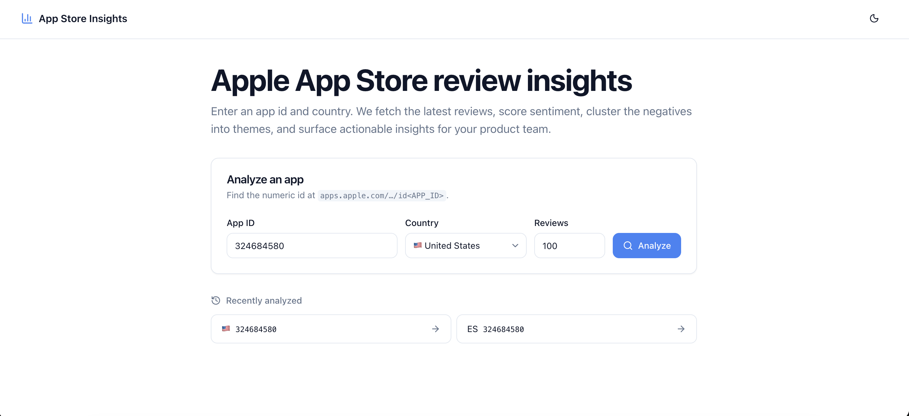
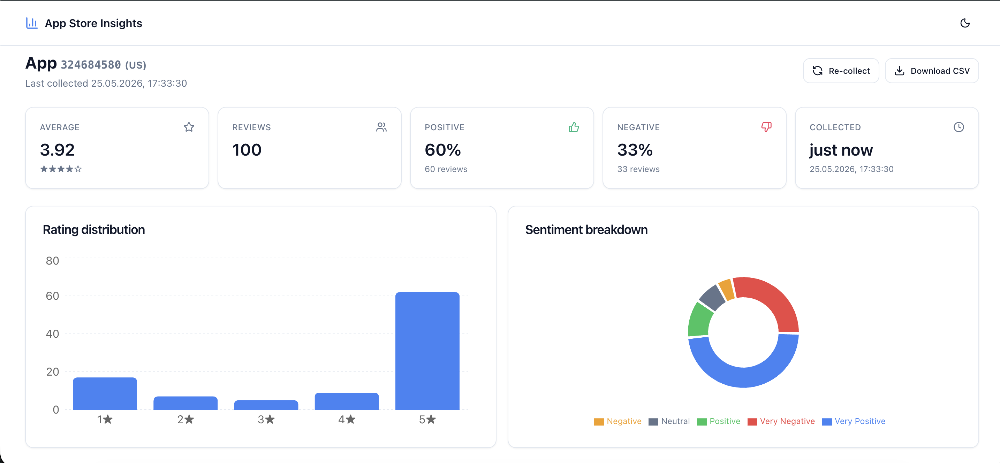
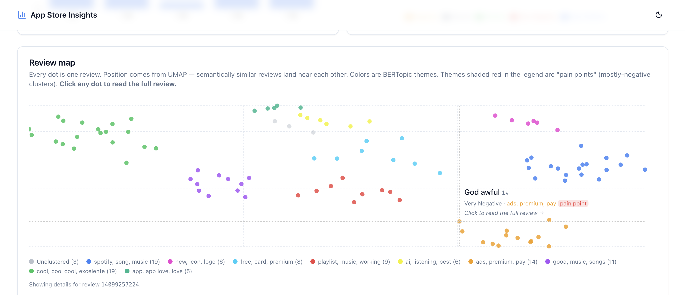
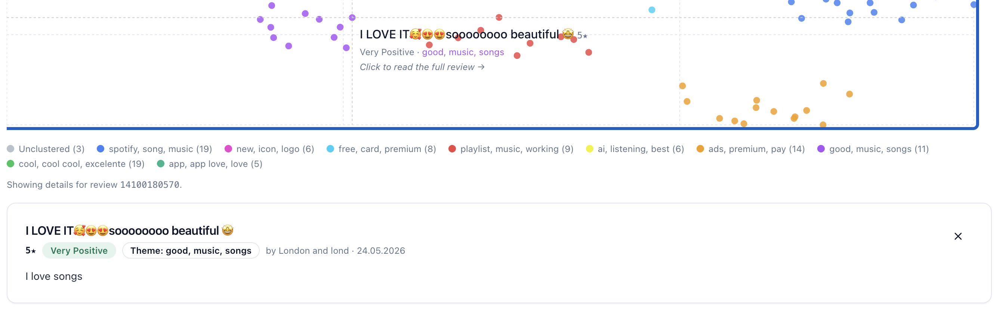
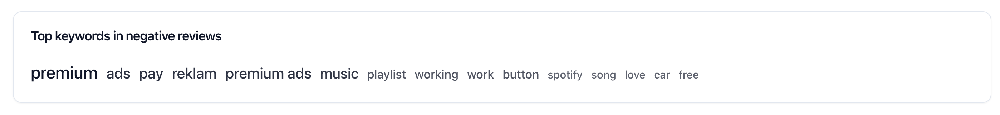
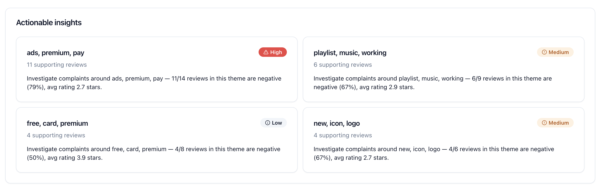
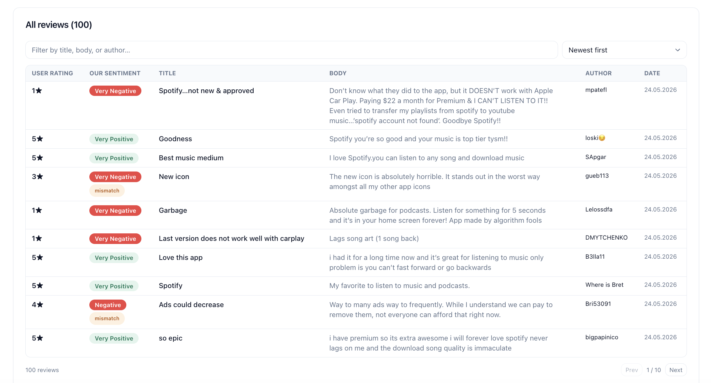

# UI walkthrough

A short guide to what the dashboard shows and how to read it, with screenshots from a real run against Spotify US. The same data the dashboard renders is also available as raw JSON and CSV in [`data/`](./data/) — see [`README.md`](./README.md) for the file map.

---

## Home page

The landing page is a single form: an Apple app id, a country dropdown, and a review-limit input. The country dropdown is restricted to a curated list of supported App Store storefronts because Apple's catalog is regional and each country exposes a different review pool. The review limit defaults to one hundred and goes up to two thousand, which is the practical cap Apple's web endpoint returns before falling off.

Below the form, a "Recently analyzed" panel surfaces the last few apps the user collected (kept in `localStorage` — no server state involved). Clicking one of them jumps straight to the dashboard for that app without re-collecting.

When the user submits, the form replaces itself with a live stage list that streams over NDJSON from `/collect/stream`. Each pipeline stage emits a `started` event when it begins and a `completed` event with a duration and detail string when it finishes. The progress UI shows a spinner per running stage, a checkmark with elapsed time per finished stage, and the detail string returned by the backend (for example, "100 reviews" after the fetch stage). This is the user's only feedback during the 5–25 second wait, so it's intentionally information-dense rather than just a generic loader.

---

## Dashboard header, KPIs, and the two summary charts

The dashboard header carries the app id, the country code, the last-collected timestamp parsed as UTC, and two action buttons — **Re-collect** to re-run the pipeline against the same app, and **Download CSV** to grab the raw reviews as a spreadsheet-friendly file.

Directly below the header is a five-card KPI row: average rating with a five-star visual, total reviews collected, percent positive sentiment, percent negative sentiment, and the last-collected timestamp formatted in the viewer's locale. The positive and negative percentages come from the model's sentiment classification, not from the star ratings, so they answer a different question than the average rating above them. In the screenshot, Spotify's 3.92★ average sits next to 60% positive sentiment and 33% negative sentiment — the two numbers track each other roughly because most users on this dataset wrote text that matches how they rated, but the model is reading the words independently and would diverge sharply on a different population.

Below the KPIs are two charts side-by-side. The bar chart on the left shows the per-star distribution from one to five stars — the raw frequency of each star value the users actually clicked. In Spotify's case it surfaces the bimodal shape clearly: five-star and one-star towers with a flat middle. The donut on the right shows the model-predicted sentiment in five classes (Very Negative through Very Positive). The two charts visualize the same population from different sources — the user's vote on the left, the model's read of the text on the right — and a sharp visual disagreement between them is the first signal that this dataset contains a lot of mis-rates, sarcasm, or model-noise cases.

---

## 2D review map

This is the most analytically dense part of the dashboard. Every collected review is a dot. The dot's position comes from a UMAP projection of the review's text embedding into two dimensions, so reviews whose meaning is similar end up near each other regardless of which language they're written in or what exact wording they use. The dot's color encodes which theme HDBSCAN assigned that review to; theme colors are stable across reruns because UMAP uses a fixed `random_state`.

Hovering over any dot opens a small tooltip with the review's title, rating, predicted sentiment, and theme assignment, plus a "pain point" badge if the theme is one of the negative clusters. The screenshot above shows a hover over a "God awful" 1★ review in the `ads, premium, pay` cluster — the tooltip directly identifies it as a pain point so the reader knows this region of the chart is where the negative concentration lives.

Below the map, a legend lists each theme with its name (the first three c-TF-IDF keywords) and its review count. The unclustered dots, when there are any, appear in a muted gray and are listed at the start of the legend.

Clicking any dot opens a card below the chart with the full review text, the user's star rating, the model's predicted sentiment label, and the theme the dot belongs to.

This is the closing-the-loop view: the aggregate map shows where reviews cluster, the individual card shows what those clustered reviews actually say. In the screenshot the selected review is "I LOVE IT 😍😍 sooooooo beautiful 😍" — a 5★ review with body "I love songs", which the model correctly identified as Very Positive even though the text is short and emoji-heavy. The card flips visible the matching of star rating, model sentiment, and theme assignment for one specific dot, which is exactly the level of detail a product reviewer needs when an aggregate cluster looks suspicious and they want to see what's actually inside it.

---

## Top keywords

A small word cloud lists the top keywords across the pain-point themes only — the words and bigrams BERTopic's c-TF-IDF scoring identified as most distinctive to clusters where users are complaining. Word size scales with score, so the visually largest words are the strongest signals. Generic high-frequency English words ("the", "and", "is") don't appear because the underlying `CountVectorizer` filters them out.

On this Spotify run, the largest keywords are `premium`, `ads`, and `pay`, which surfaces the monetization-friction theme without the reader needing to scroll through individual reviews. The word `reklam` (Turkish for "advertisement") is also present, showing that the multilingual embedding model brings cross-language complaints into the same pain-point cluster automatically.

---

## Actionable insights

Each pain-point cluster becomes one insight card with a severity badge (HIGH, MEDIUM, or LOW), a short description naming the cluster's defining keywords, and the supporting review count. Severity is derived from the cluster's percent-negative share: 75% or higher is HIGH, 60-74% is MEDIUM, below 60% is LOW. The cards are ordered by severity, so the highest-priority finding sits at the top regardless of cluster size.

The current Spotify run produces four insights: HIGH-severity ads/premium friction (11 of 14 reviews negative), MEDIUM-severity playlist and playback bugs (6 of 9 reviews negative), MEDIUM-severity icon and logo redesign complaints (4 of 6 negative), and LOW-severity free-tier payment friction (4 of 8 negative). Each card carries a one-line suggestion that maps directly to a concrete product investigation.

---

## Review table

The bottom section is the full review list with two columns of sentiment information side by side. The **User rating** column shows the star value the user actually clicked on the App Store. The **Our sentiment** column shows the model's predicted class for the same review's text. When the two disagree by two or more levels — a five-star review tagged Very Negative, for instance — the cell gets a small "mismatch" badge so a human reviewer can scan the list and decide whether the disagreement is a model failure, a sarcastic review, or a genuine mis-rate.

In the screenshot above, several mismatches are visible: a 3★ "New Icon" review tagged Very Negative (model reading the strongly negative body text), and a 4★ "Ads could decrease" review tagged Negative. Each mismatch invites a manual judgment — the model and the user are giving conflicting signals about the same review, and the only way to resolve it is to read the body. The table makes those candidates easy to find without forcing the reviewer to compare two separate visualizations.

The table supports a text filter across title, body, and author, plus three sort modes: newest first, rating high-to-low, and rating-vs-sentiment mismatch (which floats the strongest disagreements to the top — useful for auditing model behavior). Pagination is at ten rows per page by default.

The **Download CSV** button at the top of the dashboard exports the raw reviews — not the sentiment, not the themes — as a flat CSV. The data in [`data/reviews.csv`](./data/reviews.csv) is exactly what that button produces.
